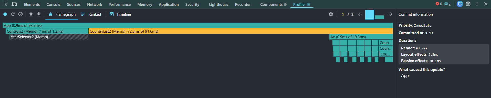
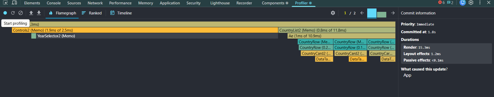
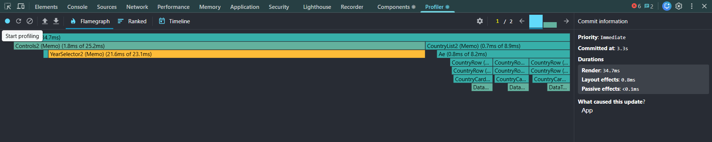
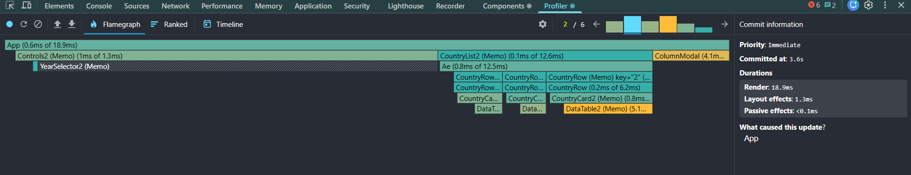

# Performance Optimization Report

## Baseline Measurements

### Interaction A: Sort countries

- **Commit duration**: 8.9 s
- **Render duration**: 528.9 ms
- **Screenshot**: 

### Interaction B: Search countries

- **Commit duration**: 3 s
- **Render duration**: 31.5 ms
- **Screenshot**: 

### Interaction C: Change year

- **Commit duration**: 7.7 s
- **Render duration**: 590.5 ms
- **Screenshot**: 

### Interaction D: Toggle column

- **Commit duration**: 5.9 s
- **Render duration**: 431.5 ms
- **Screenshot**: 

## Optimized Measurements

### Interaction A: Sort countries

- **Commit duration**: 1.9 s
- **Render duration**: 93.7 ms
- **Screenshot**: 

### Interaction B: Search countries

- **Commit duration**: 1.8 s
- **Render duration**: 15.3 ms
- **Screenshot**: 

### Interaction C: Change year

- **Commit duration**: 3.3 s
- **Render duration**: 34.7 ms
- **Screenshot**: 

### Interaction D: Toggle column

- **Commit duration**: 3.6 s
- **Render duration**: 18.9 ms
- **Screenshot**: 

## Summary of Improvements

| Interaction      | Baseline (ms) | Optimized (ms) | Improvement |
| ---------------- | ------------- | -------------- | ----------- |
| Sort countries   | 528.9         | 93.7           | 82.3%       |
| Search countries | 31.5          | 15.3           | 51.4%       |
| Change year      | 590.5         | 34.7           | 94.1%       |
| Toggle column    | 431.5         | 18.9           | 95.6%       |
| **Average**      | **395.6**     | **40.7**       | **89.7%**   |