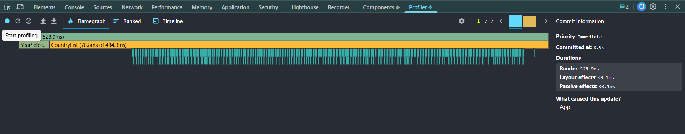
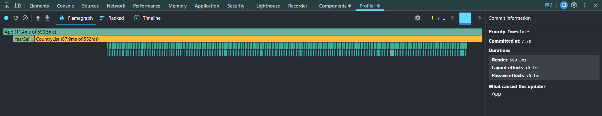
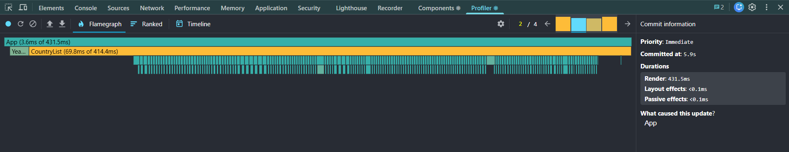

# Performance Optimization Report

## Baseline Measurements

### Interaction A: Sort countries

- **Commit duration**: 8.9 s
- **Render duration**: 528.9 ms
- **Screenshot**: 

### Interaction B: Search countries

- **Commit duration**: 3 s
- **Render duration**: 31.5 ms
- **Screenshot**: 

### Interaction C: Change year

- **Commit duration**: 7.7 s
- **Render duration**: 590.5 ms
- **Screenshot**: 

### Interaction D: Toggle column

- **Commit duration**: 5.9 s
- **Render duration**: 431.5 ms
- **Screenshot**: 